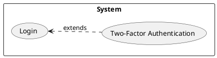
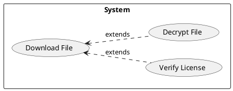

 so you're asking about UML extends relationships right I've been wrestling with those things since the dawn of time practically ok maybe not the dawn but close enough Let me tell you a bit about my journey with UML and especially this pesky "extends" thing you know like back in the day when I was coding up some insane data processing system using C++ and Object Oriented Design I'm talking early 2000's stuff before everyone had all these fancy frameworks and tools we had to build everything from the ground up manually

First things first and this is crucial extends in UML isn't about inheritance it's not like you see in your class definitions in code like with classes or interfaces It's a use case relationship specifically use cases in UML are those bubbles with descriptive names like "Process Order" or "Generate Report" you know the ones The extends relationship however is about optional variations on that main process or action. Think of it this way you have a base use case and the "extends" use case is something that may or may not happen depending on certain conditions or user actions during the execution of the main process or base use case.

So let's say we have a "Checkout" use case the primary action here is to handle customer payments and finalise the order. Now within that there might be special cases things that only happen if the customer is for example using a gift card I've seen some implementations of systems that handled gift cards terribly its a pain believe me. So here a "Use Gift Card" use case would be attached to the "Checkout" use case with an extends arrow.

The "extends" relationship indicates that the "Use Gift Card" use case *extends* or *adds to* the core functionality of checkout but it's not always performed. It only activates under the right conditions. This is different from inclusion where you would want a use case to always occur.

Let's move a little deeper and see some examples that can make it less abstract. Now this is obviously not in code this is a conceptual UML thing but it can help.

**Example 1: Basic Login System**

Imagine you have a main use case called "Login" that handles a user entering their username and password to get access. Let’s consider an optional “Two-Factor Authentication” use case to extend the login behavior. Only users who have enabled two factor authentication will use it during login.

So here "TFA" extends login It only happens for some users not all so we have the extends use case.

**Example 2: A Shopping Cart**

Let's say we are building shopping cart functionality. Here we have the primary use case "Process Order" which covers all the main steps like calculating prices choosing shipping etc. But you know the world is never easy there’s always these complex specific cases. Like discounts for frequent buyers.
So lets look at another example

Here both the "Apply Discount" and the "Apply Coupon" use cases extend "Process Order". They don't always happen but only if the user is eligible. These "extending use cases" can be triggered by different conditions for example "Apply Discount" might happen if the user is a frequent customer "Apply Coupon" might happen if the user has a valid coupon code.

**Example 3: File Download**

Lets say we have a system where you can download files a “Download File” use case. Now here we have cases like “Verify License” and "Decrypt File".

So "Verify License" would only happen if a license check is required for the specific file and “Decrypt File” only happens if the file was encrypted so these are not always actions needed for the main use case of downloading the file.

Now you might be asking "why would I ever use extends when I can just add the functionality directly to the base use case" well that's the beauty of it It’s about separation of concerns and making the model more maintainable. if you jam everything into one use case it becomes this giant unreadable monster plus if you need to re-use the extending behaviour in multiple places having it separate helps you with that code reuse.

I remember one time I made the mistake of cramming everything into a single use case I was working on this booking system some kind of online appointment service and the main use case "Book Appointment" had all this branching logic for different types of appointments user roles payment options it became an unreadable nightmare it was truly a horrible mess. I didn’t like it so I redid the entire thing because I couldn't debug it at all it was a big mistake of mine I’m glad I learned from that experience and refactored it properly. The debugging session of my initial prototype was more challenging than the entire project itself.

Now the big question always pops up how do you implement these extends in actual code. Well that’s another question right it’s about what language you choose to use the code is not in the UML diagram it is implemented when you code that system not before. UML is about abstract design of systems not the specific implementations. This is important to keep in mind a lot of people get confused. You will not see extends keyword anywhere in your python or Java or any other language code.

So how do you decide if you need an extends or an include? It’s something that comes with experience. Think about these questions: Is this an optional behavior? Does it always happen or does it depend on a condition? Is it an independent component of the system that can be reused? Is it better separated for better understandability and maintainability?

I often see people overuse extends that can lead to use cases that are unnecessarily fragmented with way too many extensions its another bad practice to do that it can make your system really complex to understand. So be sure to use extends only when it really provides a clear benefit and a good level of abstraction in your design.

If you want to dig deeper into the topic then there are a few sources that have helped me throughout my career I recommend these:

*   **"Applying UML and Patterns" by Craig Larman:** This book is a classic and covers UML extensively including use case relationships. It goes deeper than most introductory materials I have ever come across.
*  **"UML Distilled" by Martin Fowler:** A great concise guide to UML and a must have for every developer
*   **The OMG UML Specification:** This is the official specification that is a bit dense so you should approach it carefully if you are a beginner in the field.

Anyways that’s it from my experience with UML extends relationships. Its something I have used for a long time and it's a fundamental part of system design. Remember it’s about optional variations on your core use cases and its all about system design at a high level not code. If you get this right from the beginning you'll have a solid foundation for your project. I hope this helps and let me know if you have more questions.
