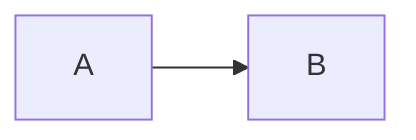
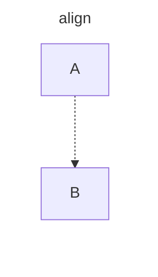
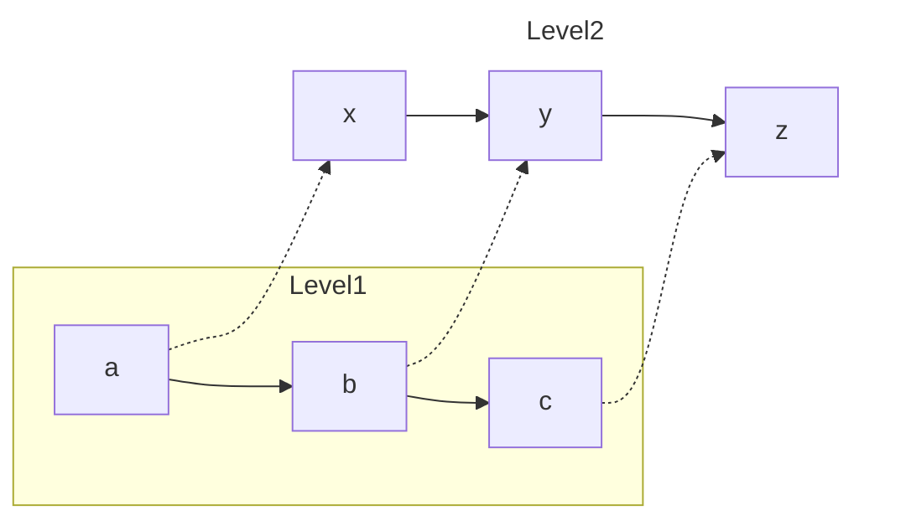

Alright, let's tackle this. The precise horizontal alignment of nodes in Mermaid diagrams, while seemingly straightforward, often presents a subtle challenge, particularly when you move beyond the basics. I've personally grappled with this more than a few times, particularly on a large documentation project where visual clarity was paramount. There’s not a single ‘align’ command you can sprinkle across the diagram; instead, it’s about understanding how Mermaid’s rendering engine processes node placement and using its features to your advantage.

The primary principle for achieving horizontal alignment lies in exploiting how Mermaid interprets explicit connections and the natural layout algorithms it uses. Simply put, a single, direct connection between two nodes will often align them horizontally if no other forces are acting on those nodes. This is not always the case with complex diagrams.

Let me give you an initial example. If you simply want two nodes placed side by side:



This will typically render nodes A and B aligned horizontally, *given default parameters.* However, as soon as you introduce more elements or connections, the default layout can quickly deviate from your desired horizontal alignment. This behavior stems from the layout engine trying to optimize the overall arrangement for minimum crossings and a reasonable overall structure, not specifically horizontal layouts.

Now, this is where things get interesting. We need to be strategic, almost like tricking the system into doing what we want. The key lies in constructing 'invisible' connections or using *subgraphs* with hidden edges. These tactics force Mermaid to consider the intended alignment during layout.

Here's the first trick in our toolkit: creating invisible connections:



Here, we've declared `A` and `B` within a subgraph labeled “align.” Critically, the connection `A -.-> B` uses a dashed line (`-.->`) which is rendered as *invisible*. This connection guides the horizontal relationship between nodes, and the `style` declaration on the subgraph effectively hides the subgraph boundary as well. Subgraphs are very effective when the relationships between nodes and overall layout is more important than group theming. This is what allows to you achieve a horizontal alignment using the invisible connection. While the subgraph isn't *required*, it allows you to apply a style with better specificity.

Consider this scenario where you need several nodes aligned horizontally on a different level and the use of the subgraph and invisible links:



In this example we have two 'levels', `Level1` and `Level2` respectively, with three connected nodes each. The nodes of each 'level' are naturally connected in a sequence, creating a horizontal layout of their own. The critical detail here is that the corresponding nodes across the levels are also connected with invisible links -  `a -.-> x`, `b -.-> y`, and `c -.-> z`. While there is no obvious relationship between these levels, the hidden links are now constraining them to align horizontally. Again, we apply the `style` declaration to the `Level2` subgraph to hide it completely, and thus only the aligned nodes of each level are shown.

One very common problem I've encountered when designing large diagrams is when additional connections between nodes throws off the alignment. Let’s suppose you want to create an explicit workflow where steps are aligned horizontally, but there's a connection between the start and end nodes. This introduces a challenge because the engine might prioritize the path with the direct connection over the overall alignment. Here’s how you could address that using invisible connections and a hidden level:

```mermaid
graph LR
    subgraph workflow
      start --> process1 --> process2 --> end
    end
    subgraph align_level
        start2 -.-> process1_align 
        process1_align -.-> process2_align
        process2_align -.-> end2
    end

    start -.-> start2
    process1 -.-> process1_align
    process2 -.-> process2_align
    end -.-> end2
    start --> end
   style align_level fill:none,stroke:none
```

Here, we introduce a *second* subgraph named `align_level`. This subgraph exists solely to maintain our horizontal alignment. The important bit is how we connect our primary workflow elements to those inside `align_level`, again using invisible connections. This subtle technique forces Mermaid to align `start`, `process1`, `process2` and `end` horizontally. While it may appear convoluted, this approach offers granular control over alignment even when cross-node relations complicate layout. `start --> end` is the additional connection that could throw off alignment if not properly managed.

It's worth mentioning that the specific positioning can also be influenced by your environment or Mermaid version. When dealing with any complex graph manipulation, understanding how specific render engines interpret the code is critical. For in-depth understanding of these nuances I’d strongly suggest consulting authoritative documentation. The core Mermaid documentation will often cover the latest implementation, and you can check the project’s github repository for more detailed discussions or specific bug reports, which can occasionally provide insight into unexpected behavior. Beyond these primary resources, the book "Graph Drawing: Algorithms for the Visualization of Graphs" by Giuseppe Di Battista et al provides an academic perspective on the underlying mathematical principles that govern graph layouts.

These techniques, though, can get complex quickly. You might find yourself in a situation where subtle changes in the surrounding graph cause the alignment to shift. In these cases, often the iterative process of adjustment and testing is necessary. For larger diagrams, modularizing the code and breaking out sections can significantly reduce the complexity, which is often the case with programming itself. In conclusion, precise horizontal alignment in Mermaid diagrams is less about a single magic command and more about strategic placement of nodes, connections (sometimes hidden ones), and a good understanding of how Mermaid interprets the data to render a graph.
