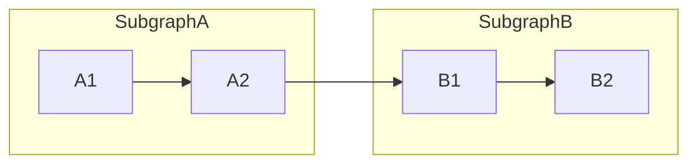
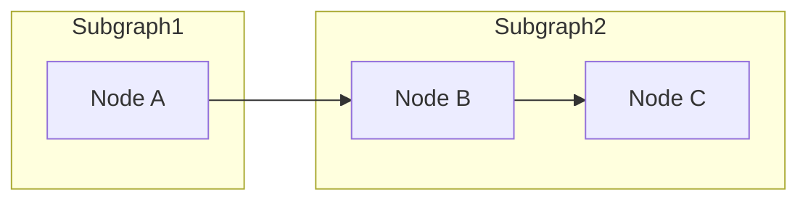
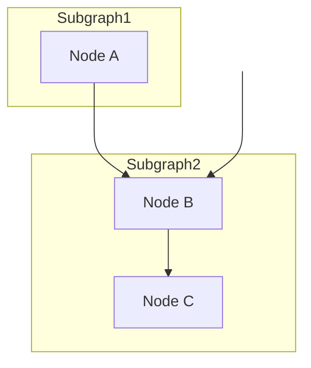
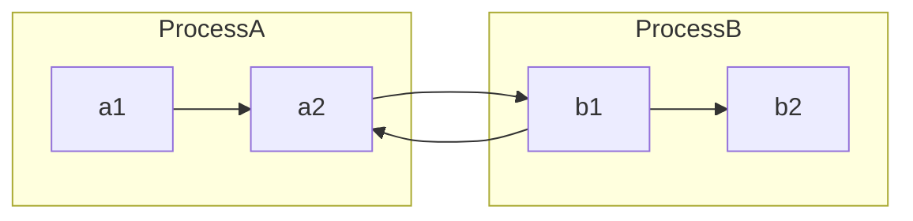
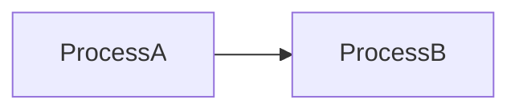

Okay, let's tackle this. I remember wrestling with this exact issue a few years back when building an internal documentation platform. Mermaid diagrams were fantastic for visualizing complex processes, but those pesky link overlays were a real pain, particularly when you had subgraphs nestled inside larger ones. The default rendering often resulted in link arrows running smack-dab over subgraph titles, making the whole thing look like a jumbled mess. So, let's break down how to avoid that specific scenario using a few techniques I've found effective.

The core problem arises from how Mermaid's layout engine positions links in relation to other graph elements. It’s a geometric calculation, placing arrows based on node boundaries and ignoring whether there's text overlaying that path. Unfortunately, there's no single, perfect, universal setting that completely solves this in every conceivable scenario. Instead, it often requires a combination of strategies and careful graph structuring. We'll primarily deal with adjusting link paths and using whitespace to our advantage.

First, a fairly common and straightforward approach is to alter the link paths themselves, utilizing more direct connections and sometimes avoiding the default curves. This means instead of a Bezier-like curve, you might opt for a straight line. While not always aesthetically preferred, it's often the easiest way to get those links out of the way. This method works best for cases where you have links running between nodes that are relatively close to each other but positioned such that a standard curve would intercept with a title.

Here’s an example of how you can use this. Let's say we have two subgraphs with nodes inside:

Here, the arrow from `A2` to `B1` may often overlap the subgraphs labels. One can enforce a direct path instead:

By using the empty label and a default arrow, we force a direct, straight link. This works well in many cases where you want a more direct path. The whitespace label serves as an acceptable workaround; it's not pretty, but it forces a straight link, and depending on your use case, the minimal disruption it causes can be preferred over a curved, title-obscuring one.

Another technique, which I utilized extensively in that internal tool, is to manipulate the placement of the subgraph nodes themselves to create enough visual spacing. This, coupled with the direct path method above, usually solves the issue. This is akin to doing some manual layout adjustments. Think of it as a less automatic layout and more of "guiding" Mermaid.

Let's take a slightly more complex example:

Here, the arrow connecting `A` to `B` might clash with the subgraph titles. To fix this, we’ll introduce "dummy" nodes and use the `TB` graph direction directive for top-to-bottom layouts, to manipulate positioning:

By introducing `space1` and making it invisible, we create spatial separation. The forced connection from `space1` to `B` ensures that `Subgraph2` is moved down the canvas, allowing the `A` to `B` link a bit more room. It's crude but efficient. This is often necessary when dealing with more intricate graph designs.

Thirdly, consider structuring the graph such that links between subgraphs are minimized in critical areas. That might seem overly simplistic, but sometimes restructuring your diagram to represent the flow differently can reduce or eliminate overlap issues. In some circumstances, it means redesigning a bit. It’s less about code and more about layout strategy. When a critical link has to be used, combine that with one of the methods outlined above.

Let's illustrate:

Here we have a problematic bidirectional relationship between process a and b. By reworking the process, if permissible, we might have something that looks like this instead:

This is a simplistic solution in this case. The point is, refactor for clarity and to avoid links crossing your titles when possible and if it does, apply one of the previous techniques.

For further study, I'd recommend looking into resources that go into depth on graph layout algorithms. The book "Graph Drawing: Algorithms for the Visualization of Graphs" by Giuseppe Di Battista, Peter Eades, Roberto Tamassia, and Ioannis G. Tollis is a great starting point to understand the mathematics behind these issues. Also, researching papers on "Force-Directed Graph Layouts" can provide more in-depth understanding of the common algorithms and their inherent issues. Although Mermaid does not directly let you manipulate all the layout algorithms directly, understanding the core concepts allows for creating diagrams that minimize the types of problems we've been discussing.

In summary, preventing link overlays on subgraph titles in Mermaid often involves a combination of strategies. Direct paths, whitespace manipulation with dummy nodes, and mindful graph restructuring are generally the most useful techniques. While not always perfect, these methods allow for a better visual outcome and improve the readability of your diagrams. There isn't one magic bullet and each situation will have specific nuances. The techniques I’ve described above have been battle-tested in the wild and I’ve found them to be dependable.
