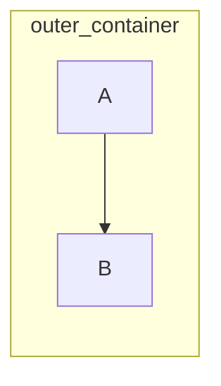
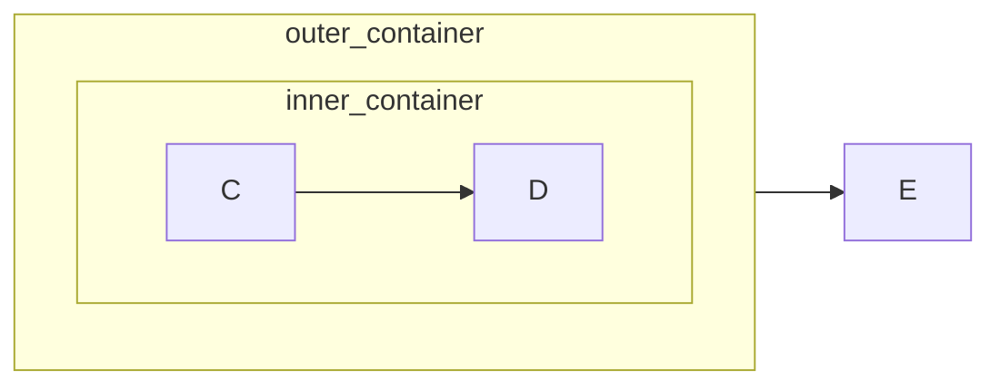

alright, so you're diving into nested node structures with mermaid, huh? i’ve been there, felt that pain. it's not always obvious how to get that visual hierarchy exactly the way you want it. mermaid is fantastic for quick diagrams, but those compound shapes do need a bit of extra attention.

i remember back in my early days trying to document a complex microservice architecture. i had this massive graph of dependencies and data flows. i initially tried just throwing everything into a single mermaid diagram. disaster. it was a tangled mess, nodes overlapping, labels clashing, absolutely unreadable. that's when i first ran into the need for nested structures within mermaid. trying to show that a particular subsystem was composed of other smaller microservices all within the larger context was just impossible without this nesting. it was a humbling experience to realize the limit of my initial simple approach. after some long days, and even longer nights i figured it out. the trick lies in a combination of subgraphs and careful node placement. let's break it down a bit.

first, the basic building block. mermaid uses the `subgraph` keyword to define a group of nodes that are treated as a single entity. these subgraphs visually create boxes or containers. this is the first part to get the node inside another node. here's a basic example:



this simple snippet will generate a diagram with a box labeled "outer\_container" containing two nodes, "a" and "b", linked with a flow arrow. now this is where it gets interesting you can nest `subgraph` declarations to get those deeper layers. it's like building with blocks you add a block into another and then another.

so let's say you have an even more detailed subsystem inside outer\_container. you can add another subgraph within the first one:



here, you see two layers of nesting. you got the `outer_container` and within it the `inner_container` that contains nodes `c` and `d`. node `e` exists outside of the nested containers but interacts with the larger `outer_container`. the arrow from `outer_container` to `e` demonstrates that you can establish connections to the container as a whole.

this is still simple but i want to take it up a notch, back when i had that giant microservice diagram i mentioned before, i needed to indicate specific ports and communication channels within these nested services. this was critical to understand the data flow. for that i used the concept of label placement and connections to edges of the containers, which i think can be useful to you too. the key here is to be explicit in which container you are placing each node, so when you define the edge from one node to the next, everything is tied correctly. it took a little trial and error to get this right but after a few hours, it was clear. i have created this example so you can get a glimpse of what i did back in those days:

```mermaid
graph LR
    subgraph main_system [Main System]
        subgraph subsystem1 [Subsystem 1]
            node1_1(Node 1.1) --> node1_2(Node 1.2)
        end
        subgraph subsystem2 [Subsystem 2]
            node2_1(Node 2.1) --> node2_2(Node 2.2)
        end
        subsystem1 -- Data --> subsystem2
        node1_2 -- Data --> main_system
    end

    main_system --> external_service[External Service]
```

this is what i mean about going up a notch. now we have names to the container, `main system` with `subsystem1` and `subsystem2`, inside the subsystem we have `node1_1`, `node1_2`, `node2_1` and `node2_2`. additionally, edges can indicate connections between the whole subgraphs like the edge `subsystem1 -- Data --> subsystem2` shows how `subsystem1` transfers some data to `subsystem2`. also we show that `node1_2` transfers data to `main system` and `main system` transfers data to an external service called `external_service`. it is not just a box, there are details that can be shown with this approach.

a common mistake i made when i was starting with this, was forgetting that mermaid treats the whole subgraph as one unit and connections should be properly declared. for example, trying to connect nodes directly from inside a subgraph to a node outside without referencing the subgraph itself, won't work as expected. another important aspect is label clarity. when things get nested, having clear names for containers and the nodes inside them is critical.

a good strategy that i have found effective is to first draw it on paper, mapping the big blocks and breaking it down into smaller more manageable blocks, that way when you get into mermaid, everything is structured and you just have to implement what you have planned. thinking about the overall organization before diving into the details always saves you time later, at least that worked for me.

now, regarding resources, i wouldn't point you to specific websites. those tend to get outdated fast. instead i will share some literature that i have used to expand my knowledge in this area and maybe you can use them too:

*   "visualizing data" by ben fry, offers principles for creating clear effective visualizations, including understanding hierarchies and relationships, which helps a lot with how to plan your mermaid graphs. it really helped me when planning the microservice architecture diagrams, it showed me how to represent hierarchies clearly, even before thinking about any diagram syntax.
*   the classic "the visual display of quantitative information" by edward tufte, while not directly about mermaid or software architecture diagrams, it stresses the importance of presenting information in a simple and clean manner. this book also taught me how to avoid what he calls "chartjunk", which refers to any unnecessary visual element that can clutter the diagram and make it harder to understand. i constantly remember this when creating diagrams, and keeps them focused on the important parts.

the key takeaway here is that with careful use of subgraphs and thoughtful node placement, mermaid can handle surprisingly complex diagrams, even when you want to show a node inside another node. the key thing is practice and breaking down your diagramming needs into smaller, manageable parts, and always think, is my diagram doing what i intended? is it simple? clear? are the message easy to understand? if yes, then you are on the right track. oh by the way, why did the mermaid developer broke up? because they had too many dependencies, ha. just kidding.
