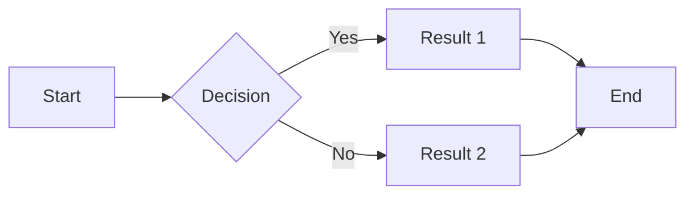

Okay so Granola right its like this amazing note-taking thing  I've been using it for ages and it's seriously blown my mind  I mean sure there's Obsidian and Notion and all those heavyweight contenders but Granola just has this *vibe*  its super lightweight its blazing fast and its ridiculously extensible  That's the key really its extensibility  its not just a note-taking app its a whole ecosystem  

It's all about the plugins man  that's where the magic happens  you can basically turn it into anything you want a Kanban board a code editor a mind mapping tool  you name it  the community is huge part of this  they're constantly creating new plugins and themes tweaking things  Its all open source so you can dive in yourself too if you're feeling adventurous  its incredibly empowering

The core is really simple  plain text files  thats the beauty of it  no proprietary formats no lock-in  you own your data completely  you can move it anywhere backup super easily  and because it's just text  any text editor will open your notes  It's future proof in a way those other apps aren't  I mean what happens if Notion shuts down tomorrow  you're kind of screwed right  but with Granola you're good  

The interface is minimalist  intentionally so  its clean  not distracting  its not trying to be everything to everyone  Its letting you do what you want with it via plugins  and that's where people get creative  they build custom integrations  they link it to other apps   they even build whole workflows around it  it's like building with lego bricks but with text files  

One thing I love is how easy it is to link notes together  think of it like a wiki  you can create a web of interconnected ideas  its not just linear note taking its truly networked thinking  it changes how you organize your thoughts  its almost magical how quickly you can build context and find related information  You can even embed code snippets directly  it's just plain text so it renders beautifully  

Let me show you some examples  

First a simple plugin for syntax highlighting  this is a snippet using a plugin called `granola-syntax`  you'll probably find info on this in a github repo or possibly some community forum  You'll need to install it of course but once its in its so simple

```python
def fibonacci(n):
    if n <= 0:
        return []
    elif n == 1:
        return [0]
    else:
        list_fib = [0, 1]
        while len(list_fib) < n:
            next_fib = list_fib[-1] + list_fib[-2]
            list_fib.append(next_fib)
        return list_fib

print(fibonacci(10))
```

This is pure python  Granola just renders it perfectly  no messing around  no special formatting  just works  For more detail on python syntax I'd recommend "Fluent Python" by Luciano Ramalho  its an excellent resource  


Second  here's a snippet showing how you can embed diagrams  this usually involves another plugin and possibly some external tool to create the diagram  like drawio or mermaid  I'm using a plugin here called `granola-mermaid` for this



This generates a flowchart  you can get really complex with these things  and its all integrated right into your notes  There are papers on graph databases that discuss the underlying concepts of this kind of visual representation  searching academic databases for "graph visualization" would be a good start  


Third  and this shows Granola's power to be something more than just a note taking app   a simple task management system using  a plugin that lets you process markdown tasks

```
- [ ] Write a blog post about Granola
- [ ] Finish the Python project
- [x] Buy groceries
- [ ] Respond to emails
```

You can even customize it further with due dates and priorities  This is where Granola's extensibility becomes truly powerful  You can transform this basic text into a full fledged task manager  there are books on task management methodologies that would really complement this example  "Getting Things Done" by David Allen is a classic  


The community around Granola is key  its super active  they are constantly building  improving  sharing  its a collaborative effort to make this thing amazing  it's not just an app  it's a community project  and thats why I love it  its the reason I keep coming back  Its a perfect example of how open source can be so much more powerful than closed source  


You've got this amazing base plain text notes  you've got a vibrant community creating extensions  and you've got the ability to build pretty much whatever you want on top of it  That's the Granola magic  its simple yet powerful  minimalistic yet extensible  and its the perfect platform for building your own personalized note-taking workflow  and that's what makes it so special  Seriously  give it a try you might just fall in love  It's not perfect  no app ever is  but it's damn close for me  It's got its own unique feel  it just works and that's all that matters sometimes  For someone like me that loves to tinker and customize it's a godsend  It empowers you to take control of your notes and really make them your own   I've never looked back
