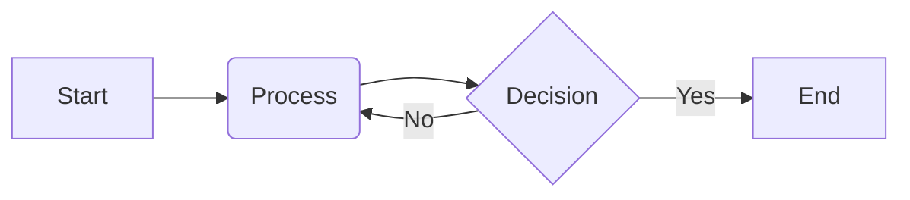
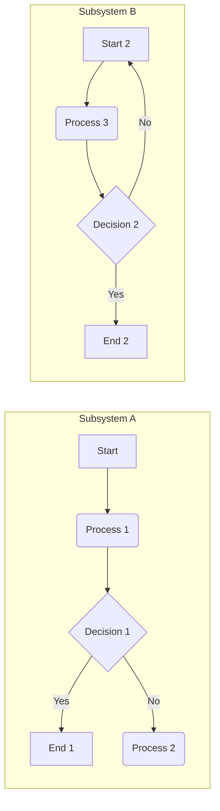

Generating high-resolution Mermaid diagrams within the Quarto/RMarkdown ecosystem requires careful consideration of both the Mermaid configuration and the output format.  My experience troubleshooting this issue across numerous data visualization projects – particularly those involving complex network graphs and intricate organizational charts – has highlighted the limitations of default rendering settings.  The key lies in leveraging the `mermaid` package's capacity for customization alongside Quarto's output options to achieve superior resolution and clarity.

**1.  Understanding the Rendering Process:**

Quarto, built upon the strengths of Pandoc, renders Mermaid diagrams by converting the Mermaid code into an intermediate format, typically SVG.  The resolution of the final output is directly influenced by this process.  The default rendering, often suitable for screen viewing, may lack the sharpness needed for print or high-resolution digital publications.  Furthermore, scaling a low-resolution SVG will result in a blurry, pixelated image.  High-resolution output demands we control the rendering resolution from the source, not through post-processing scaling.

**2.  Controlling Mermaid Diagram Resolution:**

While Mermaid itself doesn't directly control output DPI, we can indirectly influence resolution through two primary mechanisms:

* **Explicitly Setting SVG Dimensions:**  Defining the width and height of the diagram in the Mermaid code provides a target size for the generated SVG. A larger canvas allows for higher detail. The resulting image will maintain its sharpness, provided the rendering engine utilizes this information correctly.

* **Leveraging Quarto's Output Options:**  Quarto offers several output formats.  PDF output, particularly when using a high-quality engine like LaTeX, often produces superior results.  HTML output, while convenient for web deployment, can be less predictable in resolution, depending on the browser and rendering engine.

**3. Code Examples:**

Let's illustrate these concepts with three examples showcasing different levels of control and output formats:

**Example 1: Basic Mermaid Diagram with Explicit Sizing (HTML Output):**

```r


```r
```
This code snippet creates a simple flowchart.  No explicit size is set; the rendering will default to a system-determined size.  In HTML output, this might lead to a satisfactory result for screen display but might lack detail when zoomed or exported.  To improve this, we add explicit width and height attributes.

**Example 2: High-Resolution Chart with Explicit Sizing (PDF Output):**

```r

```r
```
This demonstrates a more complex chart.  To ensure high-resolution rendering for PDF output, we explicitly specify the size.  The chosen dimensions (1000px x 800px) aim for a high-resolution output, ideal for printing or high-resolution screen viewing.  Note that the effect of this depends on the chosen PDF renderer; LaTeX typically yields superior results in image quality over other options.  This improved output can be further enhanced using Quarto's configuration for LaTeX-based PDF generation.

**Example 3:  Leveraging Quarto's Configuration for Optimal PDF Output:**

This example requires a slight shift in approach.  We don't directly modify the Mermaid code, but rather leverage Quarto's YAML header to enhance the PDF output process.  While not directly affecting Mermaid resolution, the configuration below significantly enhances the quality of the rendered diagram by instructing Quarto to use a high-quality PDF engine and optimizing the image conversion process.

```yaml
---
title: "High-Resolution Mermaid Diagram"
format: pdf
documentclass: article
output:
  pdf_document:
    latex_engine: xelatex  # Using xelatex often improves image quality
    fig_caption: true
---


```r
```
Here, specifying `xelatex` (or `lualatex`) as the LaTeX engine can produce significantly better results than the default `pdflatex`, particularly in terms of font rendering and image quality.

**4.  Resource Recommendations:**

*  Consult the official Mermaid documentation for complete syntax and customization options.
*  Explore the Quarto documentation for in-depth details on output formats, configuration options, and LaTeX engine selection.
*  Review advanced LaTeX tutorials and resources to gain a better understanding of high-quality PDF generation.


By combining careful selection of Mermaid diagram dimensions with appropriate Quarto output settings and potentially the selection of specific LaTeX engines, achieving sharp, high-resolution Mermaid diagrams in Quarto/RMarkdown becomes achievable and predictable.  The approaches outlined above reflect my practical experience in achieving this, focusing on systematic control of the entire rendering pipeline rather than relying on post-hoc scaling, which invariably compromises image quality.  Remember to always check your chosen PDF viewer's settings, as incorrect display settings can also negatively impact image appearance.
