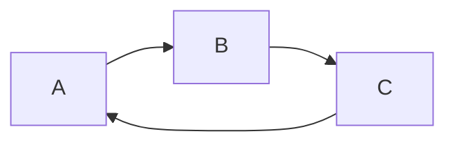
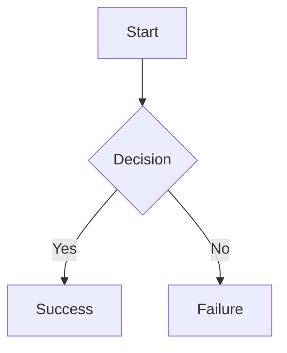
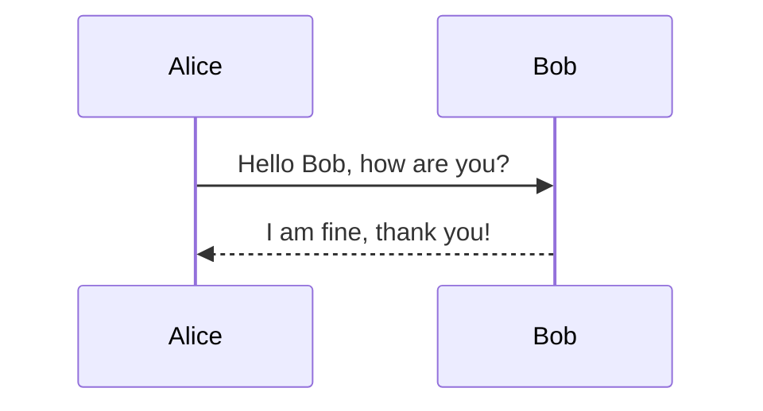

The core issue with Mermaid diagrams failing to render correctly within xaringan presentations often stems from a mismatch between the Mermaid version embedded in the presentation's JavaScript environment and the syntax used in the Mermaid code blocks.  Over the years, I've encountered this problem numerous times while developing interactive presentations, particularly when juggling different R package versions or relying on outdated dependencies.  Successful rendering necessitates ensuring complete compatibility across all relevant components.

**1. Explanation of the Rendering Process**

xaringan leverages a combination of R Markdown's engine and various JavaScript libraries for its functionality.  Crucially, Mermaid diagrams are not natively supported by R Markdown; instead, xaringan relies on an external JavaScript library, which is typically included via the `xaringanExtra` package. This library handles the parsing and rendering of the Mermaid code embedded within fenced code blocks designated as `mermaid`.

The rendering process unfolds as follows:

1. **R Markdown Compilation:**  The R Markdown document is processed by knitr, converting the R code chunks and Markdown text into an HTML structure.
2. **xaringan Processing:**  xaringan then takes this intermediate HTML and injects the necessary JavaScript libraries, including the one responsible for rendering Mermaid diagrams.
3. **JavaScript Execution:** The browser subsequently executes the injected JavaScript.  This code interacts with the HTML elements containing the Mermaid code, parses it according to the loaded Mermaid library's version, and dynamically generates the corresponding SVG or similar rendering.
4. **Diagram Display:** The final SVG (or other vector graphic) is then inserted into the presentation's HTML structure, displaying the diagram on the slide.

Failure at any point in this pipeline can lead to incorrect or absent diagram rendering. A common culprit is a disparity between the Mermaid syntax used in your R Markdown document and the capabilities of the specific Mermaid.js version bundled with your xaringan setup.  Version mismatches often manifest as completely blank spaces where diagrams should appear or as partially rendered diagrams with incorrectly formatted elements. Furthermore, issues can arise from conflicts with other JavaScript libraries loaded within the xaringan presentation.

**2. Code Examples and Commentary**

Let's illustrate this with three examples, highlighting potential problems and solutions.

**Example 1: Syntax Error Due to Version Mismatch**

```r

```

This simple graph should render correctly. However, if the included Mermaid library is significantly older, it may not understand more recent syntax introduced in later versions.  In older versions, the `graph LR` syntax might be deprecated.  To fix this, one might need to revert to an older, compatible syntax or update the Mermaid.js library.


**Example 2: Missing Library Inclusion**

```r
---
title: "My Presentation"
output:
  xaringan::moon_reader:
    css: ["default", "my-theme.css"]
    nature:
      highlightStyle: github
      highlightLines: true
      countIncrementalSlides: false
---



This example highlights the necessity of ensuring the correct Mermaid library is included. If the `xaringanExtra` package or similar isn't properly loaded or its dependencies are incomplete, the `mermaid` code block will not be processed correctly and the diagram won't appear.  Ensuring `xaringanExtra::use_xaringan_extra()` is called within the YAML header or an appropriate setup chunk is vital.

**Example 3: Conflicting JavaScript Libraries**

```r
---
title: "My Presentation"
output:
  xaringan::moon_reader:
    css: ["default", "my-theme.css"]
    nature:
      highlightStyle: github
      highlightLines: true
      countIncrementalSlides: false
---

```{r, include=FALSE}
xaringanExtra::use_xaringan_extra(
  c("tile_view", "animate_css", "tachyons")
)
```



Here, we introduce other `xaringanExtra` features.  Sometimes, conflicts can occur between these additional libraries and the Mermaid library. This might lead to rendering problems.  Addressing such conflicts often involves carefully reviewing the package dependencies and attempting to resolve any version incompatibilities by adjusting package versions, or, in extreme cases, manually loading the JavaScript libraries in a specific order to avoid conflicts.

**3. Resource Recommendations**

I recommend meticulously reviewing the documentation for xaringan and `xaringanExtra`, paying close attention to the section on incorporating external JavaScript libraries.   Understanding the package dependencies and potential version conflicts is essential.   Consult the Mermaid.js documentation to understand the supported syntax and ensure consistency between your code and the library’s version.  Finally, careful examination of the browser's developer console for JavaScript errors can provide invaluable clues in diagnosing rendering problems.  Systematic troubleshooting by isolating potential issues and testing different setups incrementally is often the most effective approach.  Remember, checking the completeness and compatibility of the required JavaScript libraries is fundamental.
